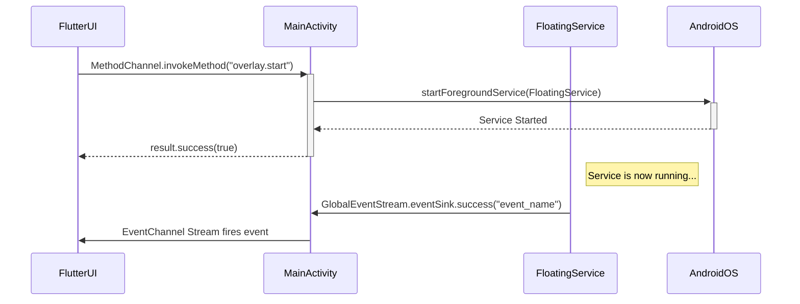

# Android Application Host

# Android Application Host (`MainActivity.kt`)

This document provides a technical overview of the `MainActivity.kt` module, which serves as the primary integration point between the Flutter UI and the native Android platform for the Assistive Touch application.

## Overview

`MainActivity.kt` is the Android entry point for the Flutter application. Its core responsibility is to act as a bridge, enabling the Flutter front-end to invoke native Android functionality. This includes managing the lifecycle of the floating overlay service, handling system permissions, and receiving asynchronous events from native components.

It uses Flutter's platform channel mechanism, specifically `MethodChannel` for Flutter-to-native calls and `EventChannel` for native-to-Flutter events.

## Architecture and Communication Flow

The `MainActivity` establishes two-way communication with the Flutter UI.

*   **Flutter -> Native**: The Flutter UI sends commands (e.g., "start the service," "check permissions") via a `MethodChannel`. `MainActivity` listens for these commands, executes the corresponding native Android code, and returns a result.
*   **Native -> Flutter**: Native components, particularly the `FloatingService`, can send asynchronous events (e.g., "button tapped," "panel opened") to the Flutter UI. `MainActivity` sets up an `EventChannel` and funnels these events through a global singleton, `GlobalEventStream`.

This architecture decouples the Flutter UI from the specifics of the Android implementation.

## Key Components

### `configureFlutterEngine`

This is the central method where all native integrations are configured. It's called by the `FlutterActivity` lifecycle and is responsible for initializing both the `MethodChannel` and the `EventChannel`.

### Method Channel: `com.meghraj.assistivetouch/methods`

This channel handles imperative calls from Flutter to the native Android host. The handler is a `when` block that routes calls based on the method string.

#### **Service Management**

*   `overlay.start`
    *   **Description**: Starts the `FloatingService`, which displays the floating UI element.
    *   **Implementation**: Creates an `Intent` for `FloatingService`. It correctly uses `startForegroundService` on Android Oreo (API 26) and above to comply with background execution limits, falling back to `startService` on older versions.
    *   **Returns**: `true` on success.

*   `overlay.stop`
    *   **Description**: Stops the running `FloatingService`.
    *   **Implementation**: Calls `stopService` with an `Intent` for `FloatingService`.
    *   **Returns**: `true` on success.

*   `overlay.updateConfig`
    *   **Description**: Notifies the running `FloatingService` that its configuration may have changed and needs to be reloaded.
    *   **Implementation**: Calls the static `refreshConfig()` method on the `FloatingService.instance`. This assumes the service is running and its singleton instance is available.
    *   **Returns**: `true` on success.

#### **Permissions Handling**

*   `permissions.getState`
    *   **Description**: Checks the current status of required permissions.
    *   **Implementation**:
        *   **Overlay**: Checks `Settings.canDrawOverlays(this)` for the "draw over other apps" permission on Android Marshmallow (API 23) and above. Defaults to `true` on older versions where the permission is granted at install time.
        *   **Accessibility & Device Admin**: Currently hardcoded to `false`. These are marked with `TODO` comments, indicating areas for future implementation.
    *   **Returns**: A `Map<String, Boolean>` with keys `overlay`, `accessibility`, and `deviceAdmin`.

*   `permissions.openOverlaySettings`
    *   **Description**: Opens the system settings screen where the user can grant the "draw over other apps" permission for this application.
    *   **Implementation**: Creates and starts an `Intent` with the `Settings.ACTION_MANAGE_OVERLAY_PERMISSION` action, targeting the app's specific package. This is only effective on Android Marshmallow and above.
    *   **Returns**: `true`.

### Event Channel: `com.meghraj.assistivetouch/events`

This channel provides a stream for broadcasting events from the native side back to Flutter.

*   **Purpose**: To allow components outside of `MainActivity` (like `FloatingService`) to communicate with the Flutter UI without holding a direct reference to the activity or its channels.
*   **Implementation**: The `StreamHandler` implementation assigns the Flutter `EventSink` to a static property on a singleton object, `GlobalEventStream.eventSink`, when a listener is attached (`onListen`). When the listener is removed (`onCancel`), the sink is set to `null`.
*   **Usage**: Any native component can now send an event to Flutter by calling `GlobalEventStream.eventSink?.success("your_event_data")`. This is a crucial pattern for decoupling the background service from the main activity.