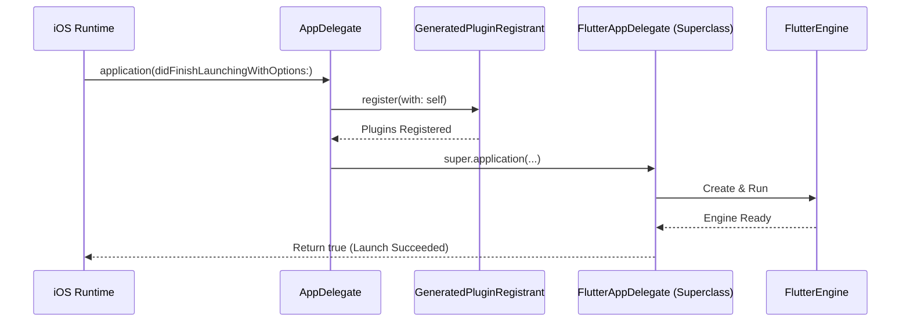

# iOS Application Host

Of course. Here is the technical documentation for the iOS Application Host module.

---

# iOS Application Host (`AppDelegate.swift`)

## Overview

The `AppDelegate.swift` file is the primary entry point for the native iOS application that hosts our Flutter UI. When a user launches the app on an iOS device, the operating system hands control to this module. Its core responsibility is to configure the native environment and bootstrap the Flutter engine, which in turn runs the Dart code and renders the user interface.

This file is the main bridge between the native iOS platform and the Flutter framework. It's the place to configure application-level services, handle OS-level events (like push notifications or deep links), and register native plugins.

## Architecture and Key Components

The architecture is simple and relies on inheritance from the Flutter framework's provided base class to handle the heavy lifting of engine setup.

### `AppDelegate` Class

This is the central class of the module. The `@main` attribute above the class declaration designates it as the application's entry point, instructing the Swift compiler to generate the necessary startup code.

The class inherits from `FlutterAppDelegate`, not a standard `UIResponder` or `UIApplicationDelegate`. This is the key to its function.

### `FlutterAppDelegate` (Superclass)

By subclassing `FlutterAppDelegate`, our `AppDelegate` inherits all the necessary logic to:
*   Create and manage a `FlutterEngine`.
*   Set up a `FlutterViewController` to display the Flutter UI.
*   Connect the iOS application lifecycle events (e.g., `applicationDidEnterBackground`) to the Flutter engine.

This delegation pattern means our `AppDelegate` can remain lightweight, containing only the specific launch-time logic our application requires.

## Application Launch Flow

The primary logic resides in the `application(_:didFinishLaunchingWithOptions:)` method. This is a standard iOS lifecycle method called by the OS when the app has finished launching and is ready to run.

The execution flow is straightforward:

1.  **Plugin Registration**:
    ```swift
    GeneratedPluginRegistrant.register(with: self)
    ```
    This line is critical for projects that use Flutter plugins with native iOS code (e.g., `camera`, `shared_preferences`, `firebase_core`). The `GeneratedPluginRegistrant` is an auto-generated file that contains the necessary code to find and register all native plugin implementations with the Flutter engine. Without this call, any platform channel communication from a plugin will fail.

2.  **Delegation to Superclass**:
    ```swift
    return super.application(application, didFinishLaunchingWithOptions: launchOptions)
    ```
    After registering plugins, control is passed to the superclass (`FlutterAppDelegate`). This call triggers the core Flutter setup: it initializes the `FlutterEngine`, loads your Dart code, and presents the `FlutterViewController` as the root view of the application.

Here is a simplified diagram of the launch sequence:



## How to Customize

While the default template is minimal, `AppDelegate.swift` is the correct place to add custom native iOS functionality. Developers modifying or extending the app's native capabilities will primarily work in this file.

Common customizations include:

*   **Initializing Native SDKs**: If you are using a third-party iOS SDK for analytics, crash reporting, or advertising, you would typically initialize it here before the `super.application` call.

    ```swift
    // Example: Initializing a hypothetical Analytics SDK
    AnalyticsSDK.start(withKey: "YOUR_API_KEY")

    GeneratedPluginRegistrant.register(with: self)
    return super.application(application, didFinishLaunchingWithOptions: launchOptions)
    ```

*   **Setting up Platform Channels**: For custom communication between your Dart code and native Swift code, you can set up `FlutterMethodChannel` instances here. This is typically done by accessing the `FlutterViewController` that `FlutterAppDelegate` creates.

*   **Handling Push Notifications or Deep Links**: You would override other `UIApplicationDelegate` methods within this class to handle incoming push notifications, universal links, or custom URL schemes. The `FlutterAppDelegate` base class will forward any unimplemented delegate methods, so you can add new ones without breaking the existing Flutter integration.