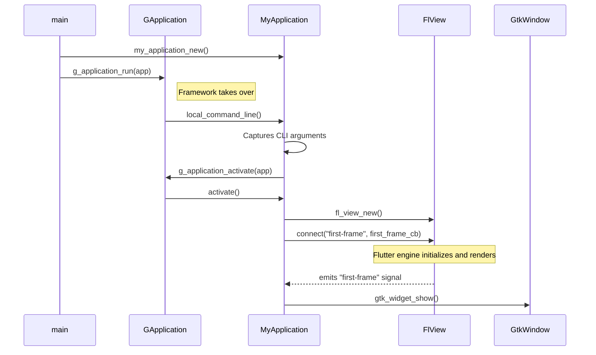

# Linux Application Host

# Linux Application Host

This document provides a technical overview of the Linux application host module. Its purpose is to bootstrap the GTK+ application, create the main window, and host the Flutter engine view.

## Overview

The Linux host is a C++ application built on the GLib/GObject and GTK+ frameworks. It serves as the native shell for the Flutter UI. Its primary responsibilities are:

*   **Application Lifecycle:** Managing the application's entry point, startup, and shutdown using the `GApplication` model.
*   **Window Management:** Creating and managing the native `GtkWindow` that contains the Flutter content.
*   **Flutter Engine Hosting:** Initializing the Flutter for Linux (`FlView`) widget, loading the Dart project, and registering native plugins.
*   **Argument Passing:** Forwarding command-line arguments from the native process to the Dart `main()` function.

The core of the host is the `MyApplication` class, a subclass of `GtkApplication`, which orchestrates these responsibilities.

## Architecture and Execution Flow

The application follows a standard `GApplication` startup sequence, which defers window creation and presentation until the application is fully activated. The integration with the Flutter engine includes an additional step to prevent a blank window from appearing before the first Flutter frame is rendered.



### Key Stages

1.  **Initialization (`main`)**: The `main` function in `main.cc` is the C entry point. It creates an instance of `MyApplication` via `my_application_new()` and hands control over to the GLib framework by calling `g_application_run()`.

2.  **Command Line Handling (`my_application_local_command_line`)**: As part of the `GApplication` startup, the `local_command_line` virtual function is invoked. This function captures all command-line arguments (stripping the binary name) and stores them in `self->dart_entrypoint_arguments`. It then proceeds to activate the application.

3.  **Activation (`my_application_activate`)**: This is the main workhorse function where the UI is constructed.
    *   A `GtkWindow` is created.
    *   It dynamically decides whether to use a modern `GtkHeaderBar` (for GNOME Shell) or a traditional title bar for better compatibility with other window managers (e.g., tiling WMs).
    *   A `FlDartProject` is configured, and the captured command-line arguments are passed to it using `fl_dart_project_set_dart_entrypoint_arguments`.
    *   The `FlView` widget, which hosts the Flutter UI, is instantiated with the project.
    *   The `FlView` is added to the `GtkWindow`.
    *   Crucially, it connects a callback, `first_frame_cb`, to the `FlView`'s `"first-frame"` signal. The window itself is **not** shown at this stage.

4.  **First Frame and Window Presentation (`first_frame_cb`)**: The Flutter engine loads the Dart code and begins rendering. Once it has produced the first frame, the `FlView` emits the `"first-frame"` signal. The connected `first_frame_cb` callback is then executed, which finally calls `gtk_widget_show()` on the top-level window. This deferred presentation ensures a smooth startup, avoiding any flash of an empty or un-rendered window.

## Core Components

### `MyApplication` (GtkApplication)

This class encapsulates the application's logic and lifecycle. It's defined using the GObject type system (`G_DEFINE_TYPE`). Its behavior is defined by overriding the virtual functions of its parent class, `GApplication`.

*   **`my_application_new()`**: The public factory function. It sets the program name using `g_set_prgname` to ensure proper desktop environment integration (e.g., matching the running process to a `.desktop` file) before creating a new `MyApplication` object.
*   **`my_application_class_init()`**: Initializes the class by connecting our custom implementations to the parent `GApplication` and `GObject` virtual functions (`activate`, `local_command_line`, `dispose`, etc.).
*   **`my_application_dispose()`**: Handles resource cleanup. It is responsible for freeing the `dart_entrypoint_arguments` array.

### Window Management

The logic for creating the window decoration is located inside `my_application_activate`.

```cpp
// linux/runner/my_application.cc

gboolean use_header_bar = TRUE;
#ifdef GDK_WINDOWING_X11
GdkScreen* screen = gtk_window_get_screen(window);
if (GDK_IS_X11_SCREEN(screen)) {
  const gchar* wm_name = gdk_x11_screen_get_window_manager_name(screen);
  if (g_strcmp0(wm_name, "GNOME Shell") != 0) {
    use_header_bar = FALSE;
  }
}
#endif
```

This code checks if the application is running under the X11 windowing system. If so, it queries the window manager's name. If the window manager is not `"GNOME Shell"`, it falls back to a standard title bar. This improves the user experience on tiling window managers that may not handle client-side decorations (like `GtkHeaderBar`) well. On Wayland, it assumes the header bar will work correctly.

### Flutter Integration

The connection to the Flutter world is managed by three key components from the `flutter_linux` library:

*   **`FlDartProject`**: An object representing the Flutter project on disk. It's used to configure Dart-specific settings, most importantly the entrypoint arguments.
*   **`FlView`**: The GTK widget that embeds the Flutter engine's output. It handles rendering and input translation (mouse, keyboard, etc.).
*   **`fl_register_plugins()`**: A generated function (in `flutter/generated_plugin_registrant.h`) that finds and initializes any native code required by the plugins used in the Flutter app. It is called after the `FlView` is created.