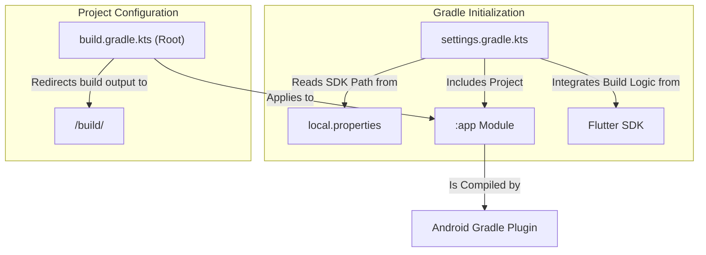

# Other — android

# Module: Android Host

This document provides a technical overview of the `android` module, which serves as the native Android host for the Flutter application. It details the Gradle build configuration, project structure, and key customizations that integrate the Flutter framework with the Android build system.

## 1. Overview

The `android` directory contains a standard Android project structure that acts as a wrapper for the Flutter application. Its primary responsibility is to configure and execute the Gradle build process, which compiles the Dart/Flutter code, integrates native Android code and dependencies, and packages them into a final Android App Bundle (AAB) or APK.

The configuration is heavily customized to manage build artifacts and integrate seamlessly with the Flutter SDK's own build tooling.

## 2. Build Configuration & Key Files

The build process is orchestrated by a series of Gradle scripts and properties files. Understanding their roles is key to managing the Android build.



### `settings.gradle.kts`

This is the entry point for the Gradle build. It defines which projects are part of the build and configures plugin management.

-   **Flutter SDK Integration**: The script dynamically locates the Flutter SDK by reading the `flutter.sdk` property from `local.properties`. It then uses `includeBuild` to incorporate the Flutter Gradle plugins directly from the SDK path:
    ```kotlin
    // Dynamically finds and includes Flutter's build logic
    includeBuild("$flutterSdkPath/packages/flutter_tools/gradle")
    ```
    This integration is the core mechanism that allows Gradle to understand and build Flutter code.

-   **Project Inclusion**: It includes the main application module via `include(":app")`. This tells Gradle that the `android/app` directory is a subproject to be built.

-   **Plugin Declaration**: It makes the Android and Kotlin Gradle plugins available to subprojects using the `plugins { ... apply false }` block.

### `build.gradle.kts` (Root)

This script applies configurations to all projects within the build, including the root project and the `:app` subproject.

-   **Custom Build Directory**: The most significant customization is the redirection of the build output directory. Instead of placing build artifacts in `android/build`, this script relocates them to the monorepo's root:
    ```kotlin
    // Redirect the root build directory
    val newBuildDir: Directory = rootProject.layout.buildDirectory
            .dir("../../build")
            .get()
    rootProject.layout.buildDirectory.value(newBuildDir)

    // Redirect subproject build directories accordingly
    subprojects {
        val newSubprojectBuildDir: Directory = newBuildDir.dir(project.name)
        project.layout.buildDirectory.value(newSubprojectBuildDir)
    }
    ```
    This results in build outputs appearing in `<monorepo_root>/build/` and `<monorepo_root>/build/app/`, centralizing artifacts for easier access by CI/CD pipelines or developers.

-   **Custom `clean` Task**: To support the redirected build directory, a custom `clean` task is registered to delete the new root build directory, ensuring a consistent clean slate.
    ```kotlin
    tasks.register<Delete>("clean") {
        delete(rootProject.layout.buildDirectory)
    }
    ```

### Properties Files

-   **`gradle.properties`**: This file configures the Gradle build environment.
    -   `org.gradle.jvmargs`: Allocates significant memory (8GB heap) to the Gradle Daemon for improved build performance.
    -   `android.useAndroidX`, `android.enableJetifier`: Standard flags to enable AndroidX libraries and automatic migration of dependencies.

-   **`local.properties`**: This file contains local, machine-specific paths and should **not** be committed to version control. It is typically generated or updated by the Flutter toolchain (`flutter pub get`) or an IDE.
    -   `sdk.dir`: Path to the local Android SDK installation.
    -   `flutter.sdk`: Path to the local Flutter SDK installation. This is read by `settings.gradle.kts`.

### Gradle Wrapper (`gradlew`, `gradlew.bat`)

These are the standard Gradle Wrapper scripts. They ensure that every developer and CI machine uses the exact same version of Gradle for the build, guaranteeing consistency and reproducibility. They automatically download the specified Gradle version if it's not already present.

## 3. Build Flow and Developer Workflow

1.  **Setup**: A developer first needs a valid `local.properties` file. This is usually created by running `flutter pub get` in the project root or by opening the project in a configured IDE like Android Studio or VS Code.

2.  **Invocation**: The build is started by the Flutter tool (`flutter build apk`) or by running a Gradle task directly (e.g., `./gradlew assembleDebug`). The Flutter tool injects build-specific properties like `flutter.buildMode` into `local.properties` before invoking Gradle.

3.  **Execution**:
    -   Gradle starts by executing `settings.gradle.kts`, which identifies the Flutter SDK and the `:app` module.
    -   The root `build.gradle.kts` script then applies its configurations, including the build directory redirection.
    -   Finally, Gradle configures and executes the tasks for the `:app` module, compiling Dart code, Kotlin/Java code, processing resources, and packaging the final artifact.

4.  **Output**: Due to the configuration in `build.gradle.kts`, all build outputs (APKs, AABs, intermediate files) will be located in `<monorepo_root>/build/app/outputs/` rather than the default `android/app/build/outputs/`.