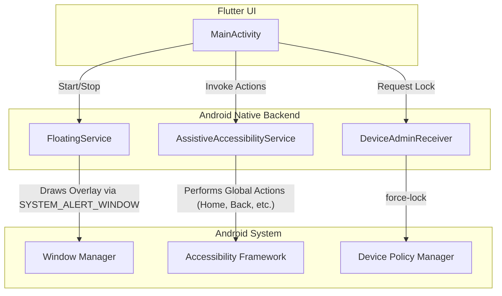

# Other — app

# Technical Documentation: Android Host Module (`android/app`)

## 1. Overview

The `android/app` module serves as the native Android host for the Flutter application. While it contains the standard boilerplate for embedding a Flutter engine, its primary role is to provide the core, low-level functionality required for the assistive touch features. This module is responsible for tasks that are outside the scope of the Flutter framework, such as drawing over other applications, interacting with the Android system at a privileged level, and managing persistent services.

The architecture is centered around a set of specialized Android components (Services and Receivers) that are controlled by the Flutter UI via a native communication bridge.

## 2. Core Native Components

The native functionality is implemented through several key Android components defined in `AndroidManifest.xml`. These components run independently of the main Flutter `Activity` and provide the app's core services.



### 2.1. `FloatingService`

The `FloatingService` is a foreground service responsible for managing the lifecycle and presentation of the floating assistive touch button/panel.

-   **Purpose**: To display a persistent UI element on top of all other applications.
-   **Mechanism**:
    -   It runs as a `specialUse` foreground service, which prevents the Android system from terminating it under memory pressure and makes its operation transparent to the user via a persistent notification.
    -   It leverages the `SYSTEM_ALERT_WINDOW` permission to draw its view, managed by the Android `WindowManager`.
-   **Lifecycle**: This service is likely started and stopped by the user from the Flutter UI in `MainActivity`. When active, it remains running even if the main application activity is closed.

### 2.2. `AssistiveAccessibilityService`

This is the most powerful component in the module, providing the ability to perform system-level actions on behalf of the user.

-   **Purpose**: To execute global actions that are normally restricted to the operating system.
-   **Mechanism**:
    -   It implements Android's `AccessibilityService` API, which requires explicit, one-time user permission from the device's Settings.
    -   The user-facing justification for this permission is defined in `res/values/strings.xml` under the `accessibility_description` key.
-   **Capabilities**: Based on the description, this service is used to perform actions such as:
    -   Simulating navigation button presses (`GLOBAL_ACTION_HOME`, `GLOBAL_ACTION_BACK`, `GLOBAL_ACTION_RECENTS`).
    -   Opening the notification panel (`GLOBAL_ACTION_NOTIFICATIONS`).
    -   Opening the quick settings panel (`GLOBAL_ACTION_QUICK_SETTINGS`).
    -   Displaying the power menu (`GLOBAL_ACTION_POWER_DIALOG`).
-   **Privacy Note**: The service is configured in `res/xml/accessibility_service_config.xml` with `android:canRetrieveWindowContent="false"`. This is a critical privacy-preserving measure, ensuring the service can *only perform actions* and cannot read any content, text, or information from the user's screen.

### 2.3. `DeviceAdminReceiver`

This component provides a single, specific function: locking the device screen.

-   **Purpose**: To allow the user to lock their device from the assistive touch panel.
-   **Mechanism**:
    -   It uses the Device Administrator API, which also requires explicit user activation.
    -   The policy configuration in `res/xml/device_admin_policies.xml` is strictly limited to `<force-lock />`, meaning it requests no other administrative permissions.
-   **Interaction**: When a user action triggers a screen lock, the application invokes the `DevicePolicyManager` to perform the lock, which is permitted because this receiver has been granted admin rights.

## 3. Permissions and Configuration

The functionality of this module is heavily dependent on user-granted permissions. A developer working on this module must be aware of the following:

| Permission/Component             | Manifest Declaration                               | Purpose                                                              |
| -------------------------------- | -------------------------------------------------- | -------------------------------------------------------------------- |
| **Draw Over Other Apps**         | `android.permission.SYSTEM_ALERT_WINDOW`           | Allows `FloatingService` to display its UI globally.                 |
| **Foreground Service**           | `android.permission.FOREGROUND_SERVICE`            | Ensures `FloatingService` can run persistently.                      |
| **Post Notifications**           | `android.permission.POST_NOTIFICATIONS`            | Required for the foreground service notification on Android 13+.     |
| **Accessibility Service**        | `<service android:name=".AssistiveAccessibilityService">` | Enables system-level actions like 'Back' and 'Home'.                 |
| **Device Administrator**         | `<receiver android:name=".DeviceAdminReceiver">`   | Enables the screen lock functionality.                               |
| **Camera (Optional)**            | `android.permission.CAMERA`                        | Likely used for a "Flashlight" toggle feature within the panel.      |

## 4. Communication with Flutter

While the Kotlin/Java source is not provided, the project structure strongly implies communication via Flutter's `MethodChannel`.

-   The Flutter UI, running within `MainActivity`, acts as the client. It sends messages to the native Android host to request actions (e.g., `"startService"`, `"performAction:home"`, `"lockScreen"`).
-   The Android side (likely within `MainActivity` or the services themselves) implements a `MethodChannel.MethodCallHandler` to receive these messages and delegate them to the appropriate native component (`FloatingService`, `AssistiveAccessibilityService`, etc.).

### ProGuard Configuration

The file `proguard-rules.pro` contains a critical rule for ensuring this communication bridge does not break in release builds:

```
-keep class com.meghraj.assistivetouch.** { *; }
```

This rule prevents ProGuard (R8) from shrinking or obfuscating any classes within the application's native package. This is essential because `MethodChannel` often relies on reflection to invoke native code. Without this rule, the handler methods could be renamed or removed, leading to runtime crashes in the production app.