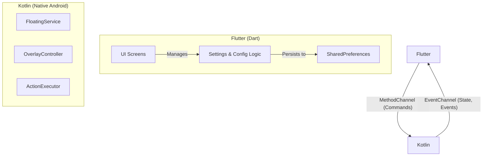

# Other — docs

# Documentation: `docs` Module

## Overview

This module contains the Product Requirements Document (PRD) for the Assistive Touch application. It serves as the foundational "source of truth" for all v1.0 development, outlining the project's goals, architecture, feature requirements, and core design principles.

For any developer working on this project, the PRD is the primary reference for understanding *what* to build and *why*. It bridges the gap between product vision and engineering implementation.

### Key Documents

-   **`PRD_v1.0_sync.txt`**: The canonical PRD for version 1.0. This document contains the complete specification, from high-level goals to detailed component breakdowns and API contracts.
-   **`PRD_v1.0.md`**: A Markdown placeholder file.

## Core Architectural Principles

The PRD establishes a clear, hybrid architecture that separates the application's concerns. Developers must adhere to this structure.

### Flutter/Kotlin Hybrid Architecture

The application is split into two distinct layers, communicating via a well-defined bridge:

1.  **Flutter (Dart) Layer**: Responsible for the user-facing configuration interface. This includes all settings screens, localization, panel/icon customization UI, and persisting user choices to `shared_preferences`.
2.  **Kotlin (Native) Layer**: Responsible for all runtime overlay functionality. This includes running the persistent `ForegroundService`, managing the `WindowManager` to display the floating button and panel, detecting gestures, and executing system-level actions.

This separation ensures that the high-performance, critical overlay logic is handled natively, while the flexible and rich UI for configuration is built with Flutter.

### The Flutter-Kotlin Bridge Contract

Communication between the two layers is strictly defined by a `MethodChannel` for commands from Flutter to Kotlin, and an `EventChannel` for events from Kotlin to Flutter.

#### MethodChannel: `com.meghraj.assistivetouch/methods`

This channel is used by the Flutter UI to control the native overlay service.

| Method                               | Description                                                                                             |
| ------------------------------------ | ------------------------------------------------------------------------------------------------------- |
| `overlay.start()`                    | Initializes and displays the floating overlay.                                                         |
| `overlay.stop()`                     | Stops the foreground service and removes the overlay.                                                   |
| `overlay.updateConfig({config})`     | Pushes the latest configuration (icon, size, opacity, panel actions) to the running overlay service.    |
| `overlay.executeAction({actionId})`  | (Primarily for testing/edge cases) Requests the native layer to execute a specific action.              |
| `permissions.getState()`             | Queries the native layer for the current status of all required permissions.                            |
| `permissions.openOverlaySettings()`  | Navigates the user to the system "Display over other apps" settings screen.                             |
| `permissions.openAccessibilitySettings()` | Navigates the user to the system Accessibility settings screen.                                         |
| `deviceAdmin.requestActivation()`    | Initiates the Device Administrator activation flow, required for the screen lock action.                |

#### EventChannel: `com.meghraj.assistivetouch/events`

This channel allows the native layer to broadcast state changes and events back to the Flutter UI.

| Event                  | Description                                                                                             |
| ---------------------- | ------------------------------------------------------------------------------------------------------- |
| `permissionStateChanged` | Fired when a critical permission (e.g., Overlay, Accessibility) is granted or revoked by the user.      |
| `overlayStateChanged`  | Notifies the UI whether the overlay service is currently running or stopped.                            |
| `batteryInfo`          | Broadcasts battery level and charging state changes if the feature is enabled.                          |
| `error`                | Reports critical errors from the native layer that the UI may need to respond to.                       |

### Performance and Reliability Mandates

The PRD sets non-negotiable performance and reliability targets that guide all implementation decisions:

-   **Interaction Latency**: Must be under **100ms** from tap to action completion.
-   **Memory Footprint**: The persistent service should consume less than **50MB RAM**.
-   **Service Stability**: The `FloatingService` is the core of the app and **must never drop**. It must correctly handle `onTaskRemoved`, `onDestroy`, and aggressive OEM battery-saving mechanisms. This is achieved by running as a `ForegroundService` with a persistent notification.

## Developer Quick Reference

This section extracts key identifiers and data structures defined in the PRD for easy access during development.

### Core Identifiers

| Type                  | Value                               |
| --------------------- | ----------------------------------- |
| Android Package Name  | `com.meghraj.assistivetouch`        |
| MethodChannel Name    | `com.meghraj.assistivetouch/methods`|
| EventChannel Name     | `com.meghraj.assistivetouch/events` |
| Foreground Channel ID | `assistive_touch_foreground`        |

### Data Schema (`shared_preferences`)

All user configurations are stored locally in `shared_preferences`. The data model follows this structure:

-   `locale`: (String) The selected language code (e.g., "en").
-   `panel.main`: (List<String>) Array of 9 action IDs for the main panel page.
-   `panel.setting`: (List<String>) Array of 9 action IDs for the settings panel page.
-   `floatingButton.iconId`: (String) Identifier for the selected floating button icon asset.
-   `floatingButton.size`: (double) The size of the floating button.
-   `floatingButton.opacity`: (double) The opacity of the floating button.
-   `ui.backgroundColor`: (int) The color value for the panel background.
-   `ui.darkMode`: (bool) The current theme state.
-   `gesture.singleTap`: (String) Action ID bound to the single tap gesture.
-   `gesture.doubleTap`: (String) Action ID bound to the double tap gesture.
-   `gesture.longPress`: (String) Action ID bound to the long press gesture.
-   `animation.speed`: (double) Multiplier for animation speed.
-   `features.showBatteryInfo`: (bool) Toggles the battery info display.

### Supported Actions (v1.0)

The following action IDs are supported for panel slots and gesture bindings:

-   `none`
-   `home`
-   `back`
-   `recents`
-   `power_dialog`
-   `notifications`
-   `lock`
-   `wifi`
-   `bluetooth`
-   `location`
-   `airplane`
-   `auto_rotate`
-   `mobile_data`
-   `volume_panel`
-   `volume_up`
-   `volume_down`
-   `sound_mode`
-   `flashlight`
-   `brightness`
-   `favorite`
-   `app_drawer`
-   `panel_page_main`
-   `panel_page_setting`
-   `open_settings`