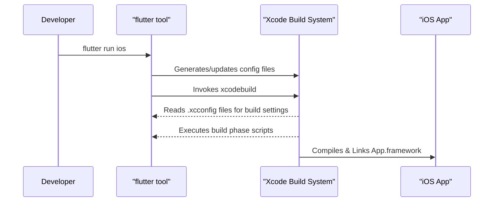

# Other — Flutter

# Module Documentation: iOS Flutter Build Integration

This document provides a technical overview of the files within the `ios/Flutter/` directory. This module is not a single executable component but rather a collection of configuration files, scripts, and metadata that form the critical bridge between the Flutter build system and Apple's native Xcode build environment.

Its primary purpose is to ensure that Xcode can correctly configure, compile, link, and debug the Flutter portion of an iOS application. Most files in this directory are automatically generated by the `flutter` tool and should not be modified directly or checked into version control.

## Overview

When you run `flutter build ios` or `flutter run` for an iOS target, the Flutter tool orchestrates the native build process by generating a set of configuration files that inject Flutter-specific settings into the Xcode project. This allows a standard Xcode project (`Runner.xcworkspace`) to build and embed the Dart code, which is compiled into a native `App.framework`.

The process can be visualized as follows:



## Key Components

The module can be broken down into three main areas: Build Configuration, Build Scripting, and Debugging Support.

### 1. Build Configuration

These files provide the core build settings that Xcode uses to compile the project.

#### `Generated.xcconfig`

This is the central configuration file generated by the Flutter tool. **It should not be edited or checked into version control.** It contains key-value pairs that define critical paths, build flags, and version information.

Key variables include:
- `FLUTTER_ROOT`: The path to the Flutter SDK on the build machine.
- `FLUTTER_APPLICATION_PATH`: The root directory of the Flutter project.
- `FLUTTER_TARGET`: The entry point for the Dart application (e.g., `lib/main.dart`).
- `FLUTTER_BUILD_NAME` / `FLUTTER_BUILD_NUMBER`: The version details, typically sourced from `pubspec.yaml`.
- `DART_OBFUSCATION`, `TRACK_WIDGET_CREATION`, `TREE_SHAKE_ICONS`: Dart compiler flags passed through from the `flutter` command line to the native build.

#### `Debug.xcconfig` & `Release.xcconfig`

These are the primary Xcode configuration files for their respective build schemes. Their main role is to include the generated settings. They do this with the line:

```
#include "Generated.xcconfig"
```

They also include the configuration from CocoaPods (`Pods-Runner.debug.xcconfig` or `Pods-Runner.release.xcconfig`), ensuring that native dependencies are correctly linked.

**Developer Guidance:** If you need to add custom, project-wide build settings, it is best practice to create a separate `.xcconfig` file and include it from `Debug.xcconfig` and `Release.xcconfig`. Avoid modifying `Generated.xcconfig` directly, as your changes will be overwritten.

### 2. Build Scripting

#### `flutter_export_environment.sh`

This shell script mirrors the variables from `Generated.xcconfig` but exports them as environment variables. It is executed by the "Run Script" build phases within the Xcode project. This makes the Flutter build settings available to any shell scripts that run as part of the native build, such as the script that packages the Flutter assets or the one that thins the binary.

### 3. Debugging Support

The files in the `ephemeral/` directory are temporary and generated to support a specific build or debug session.

#### `flutter_lldb_helper.py` & `flutter_lldbinit`

These files provide integration with LLDB, the debugger used by Xcode.
- `flutter_lldbinit`: An initialization script that LLDB loads automatically. Its sole purpose is to import the Python helper script.
- `flutter_lldb_helper.py`: A Python script that enhances LLDB's ability to debug Dart code running in the Dart VM, particularly in JIT (Just-In-Time) mode on ARM64 devices.

It works by setting a breakpoint on an internal Dart VM function named `NOTIFY_DEBUGGER_ABOUT_RX_PAGES`. When the Dart VM allocates a new page of memory and makes it executable (a common JIT compiler operation), it calls this function. The breakpoint triggers the `handle_new_rx_page` Python function, which writes a known value (`IHELPED!`) to the new memory page. This action ensures that the debugger is aware of the newly executable memory, allowing it to correctly set breakpoints and inspect code within it. Without this helper, debugging JIT-compiled Dart code would be unreliable.

### 4. Framework Metadata

#### `AppFrameworkInfo.plist`

This is a standard Apple `Info.plist` file, but it's for the `App.framework` that Flutter produces, not the main application bundle. It contains essential metadata about the compiled Flutter code, such as its bundle identifier (`io.flutter.flutter.app`), version, and minimum OS version. This information is required by iOS to correctly load and manage the framework at runtime.