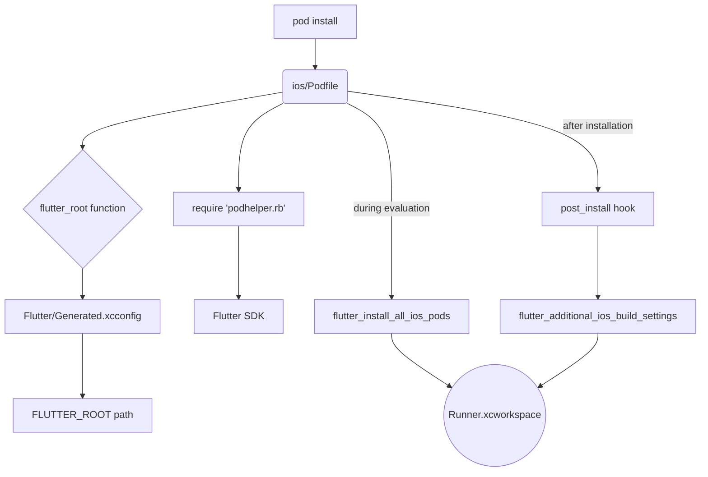

# Other — ios

# iOS Module: `Podfile`

This document provides a technical overview of the `ios/Podfile`, which is the central configuration file for managing native iOS dependencies in a Flutter project using CocoaPods.

## Overview

The `Podfile` is a Ruby script that defines the dependencies for the targets within the iOS Xcode project (`Runner.xcodeproj`). In a Flutter context, its primary role is to act as a bridge between the Flutter framework, Flutter plugins, and the native iOS build system.

It is not a static configuration. Instead, it dynamically locates the Flutter SDK and uses helper scripts provided by the Flutter toolchain to discover and integrate any required native iOS code from your project's plugins.

## Key Responsibilities

*   **Plugin Integration:** Automatically discovers and adds all necessary CocoaPods dependencies (`Pods`) required by the Flutter plugins listed in your project's `pubspec.yaml`.
*   **Flutter SDK Location:** Contains logic to find the path to the installed Flutter SDK on the developer's machine.
*   **Build Configuration:** Maps Flutter's build modes (`Debug`, `Profile`, `Release`) to the corresponding CocoaPods build configurations.
*   **Xcode Project Setup:** Injects required build settings into the generated `Pods.xcodeproj` to ensure the Flutter engine and plugins can be compiled and linked correctly.

## Execution Flow

When a developer runs `pod install` (either manually or as part of a `flutter run` command), the `Podfile` executes a series of steps to configure the native iOS workspace.



1.  **Locate Flutter SDK:** The `flutter_root` helper function is called. It reads the `Flutter/Generated.xcconfig` file to find the `FLUTTER_ROOT` path. This file is created by `flutter pub get`, making that command a prerequisite for a successful `pod install`.
2.  **Load Flutter Helpers:** It uses the located `FLUTTER_ROOT` to `require` the `podhelper.rb` script from within the Flutter SDK's toolchain. This script provides the essential integration functions.
3.  **Install Plugin Pods:** The `flutter_install_all_ios_pods` function (from `podhelper.rb`) is called. It scans the project's `.flutter-plugins-dependencies` file (also generated by `flutter pub get`) to find all plugins that contain an iOS platform implementation and adds their corresponding pods as dependencies to the `Runner` target.
4.  **Apply Build Settings:** After CocoaPods resolves and installs all dependencies, the `post_install` hook is triggered. This hook calls `flutter_additional_ios_build_settings` for each pod target, which injects necessary settings like framework search paths and build flags.

## Core Components Breakdown

### `flutter_root` Helper Function

```ruby
def flutter_root
  generated_xcode_build_settings_path = File.expand_path(File.join('..', 'Flutter', 'Generated.xcconfig'), __FILE__)
  # ...
  File.foreach(generated_xcode_build_settings_path) do |line|
    matches = line.match(/FLUTTER_ROOT\=(.*)/)
    return matches[1].strip if matches
  end
  # ...
end
```

This function is critical for making the `Podfile` environment-agnostic. It ensures that the script can always find the Flutter SDK, regardless of where it is installed on the system. If it fails, it provides a clear error message instructing the developer to run `flutter pub get`.

### Integration with Flutter Tooling (`podhelper.rb`)

The `Podfile` delegates most of its Flutter-specific logic to functions provided by `podhelper.rb`. This design ensures that as the Flutter build system evolves, projects can get updates automatically by upgrading the Flutter SDK, without needing to modify their `Podfile`.

The key functions called are:

*   `flutter_ios_podfile_setup`: Performs initial setup and configuration.
*   `flutter_install_all_ios_pods`: The core function for adding plugin dependencies. It takes the path to the `ios` directory as an argument.
*   `flutter_additional_ios_build_settings`: A post-install utility to configure build settings on each pod target.

### Target Configuration

```ruby
target 'Runner' do
  use_frameworks!

  flutter_install_all_ios_pods File.dirname(File.realpath(__FILE__))
  # ...
end
```

This is the main application target.
*   `use_frameworks!`: This standard CocoaPods directive instructs CocoaPods to build dependencies as dynamic frameworks. This is required for Swift pods and is the standard for Flutter.
*   `flutter_install_all_ios_pods`: As described above, this is the dynamic entry point for all Flutter plugin dependencies.

### Build Optimizations

```ruby
# CocoaPods analytics sends network stats synchronously affecting flutter build latency.
ENV['COCOAPODS_DISABLE_STATS'] = 'true'
```

This environment variable is set at the top of the file to disable CocoaPods analytics. This prevents a synchronous network call during the build process, which can reduce Flutter build times.

## How to Modify

For most use cases, **you should not need to edit this file directly**.

*   **To add a Flutter plugin with iOS code:** Run `flutter pub add <plugin_name>`. The Flutter toolchain will automatically update the necessary files, and the `flutter_install_all_ios_pods` function will handle the integration during the next build or `pod install`.

*   **To add a native-only iOS dependency:** If your project requires a specific CocoaPod that is *not* part of a Flutter plugin (e.g., for custom native code you've written in `Runner`), you can add it directly to the `Runner` target block.

    **Example:** Adding the `Alamofire` pod.

    ```ruby
    target 'Runner' do
      use_frameworks!
      flutter_install_all_ios_pods File.dirname(File.realpath(__FILE__))

      # Add native-only pods here
      pod 'Alamofire', '~> 5.6'
    end
    ```

After making such a change, run `pod install` from the `ios` directory.