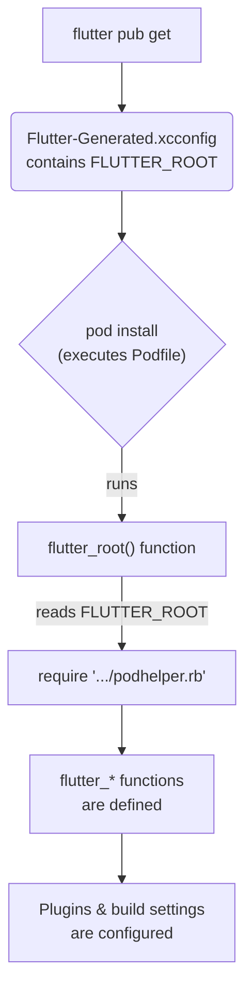

# Other — macos

# Module: macos/Podfile

The `macos/Podfile` is the central configuration file for CocoaPods, the dependency manager for the native macOS portion of a Flutter application. It is not a standard Dart or Swift module but a Ruby script that defines the native dependencies (pods) and build settings required to compile the Xcode project (`Runner.xcworkspace`).

This file acts as the bridge between the Flutter project's plugin ecosystem and the native macOS build system. It dynamically locates the Flutter SDK and uses helper scripts provided by the Flutter tool to correctly configure the project.

## Key Responsibilities

*   **Sets the macOS Deployment Target:** Defines the minimum version of macOS the application will support.
*   **Locates the Flutter SDK:** Dynamically finds the path to the current Flutter SDK to ensure build scripts and dependencies are sourced correctly.
*   **Integrates Flutter Plugins:** Automatically discovers and adds any Flutter plugins that have a native macOS implementation as CocoaPods dependencies.
*   **Configures Build Settings:** Applies necessary build settings to both the main application target and the plugin pod targets to ensure they are compatible with Flutter's build process.

## Integration with the Flutter Tool

The `Podfile`'s primary mechanism for integrating with the Flutter build system is through the `podhelper.rb` script, which is part of the Flutter SDK. The process is as follows:

1.  The `flutter pub get` command generates a `Flutter-Generated.xcconfig` file inside the `macos/Flutter/ephemeral/` directory. This file contains build settings, including the path to the Flutter SDK (`FLUTTER_ROOT`).
2.  When `pod install` is executed (either manually or as part of a `flutter run` command), the `flutter_root` function in the `Podfile` reads `Flutter-Generated.xcconfig` to find this path.
3.  Using the discovered `FLUTTER_ROOT`, the `Podfile` constructs the path to `podhelper.rb` and executes it using `require`.
4.  This `podhelper.rb` script defines the crucial `flutter_*` functions used throughout the rest of the `Podfile`.

This dynamic linking ensures that the native build process always uses the scripts and settings corresponding to the version of the Flutter SDK being used for the project.



## Core Functions

The `Podfile` relies on several key functions provided by Flutter's `podhelper.rb` script.

### `flutter_root`
A local Ruby function defined directly in the `Podfile`. Its sole purpose is to parse the `Flutter-Generated.xcconfig` file to find and return the path to the Flutter SDK. It includes essential error handling that guides the developer to run `flutter pub get` if this file or the `FLUTTER_ROOT` variable is missing.

### `flutter_macos_podfile_setup`
This function performs initial setup required before the main application target is defined.

### `flutter_install_all_macos_pods(path)`
This is the primary function for plugin integration. It scans the Flutter project (using the provided path) for all plugins that include a macOS implementation and adds them as pod dependencies to the `Runner` target. This automates the process of adding native code for packages found in `pubspec.yaml`.

### `flutter_additional_macos_build_settings(target)`
This function is called from within the `post_install` hook. It iterates over each pod target (both the main `Runner` and all plugin targets) and applies specific build settings required for compatibility with Flutter. This may include setting header search paths, defining compilation flags, or configuring code signing.

## Configuration Details

### Build Configurations
The `project` directive maps the standard Xcode build configurations (`Debug`, `Profile`, `Release`) to the corresponding CocoaPods configurations (`:debug`, `:release`). This ensures that dependencies are built with the correct optimization levels and settings.

```ruby
project 'Runner', {
  'Debug' => :debug,
  'Profile' => :release,
  'Release' => :release,
}
```

### Disabling CocoaPods Stats
The line `ENV['COCOAPODS_DISABLE_STATS'] = 'true'` is an optimization. It disables the network requests that CocoaPods analytics makes during a build, which can reduce overall build latency.

## Developer Workflow & Troubleshooting

Developers typically do not need to modify this file. Its dynamic nature is designed to work automatically with the Flutter toolchain.

The most common issue encountered is running `pod install` manually without first ensuring the project is in a valid state. The `flutter_root` function is designed to catch this with clear error messages:

*   **Error:** `...Flutter-Generated.xcconfig must exist. If you're running pod install manually, make sure "flutter pub get" is executed first`
*   **Error:** `FLUTTER_ROOT not found in ... Try deleting Flutter-Generated.xcconfig, then run "flutter pub get"`

**Solution:** In both cases, the fix is to run `flutter pub get` from the project's root directory. This command generates the necessary configuration files that the `Podfile` depends on. A subsequent `pod install` (or simply running the app via `flutter run macos`) will then succeed.