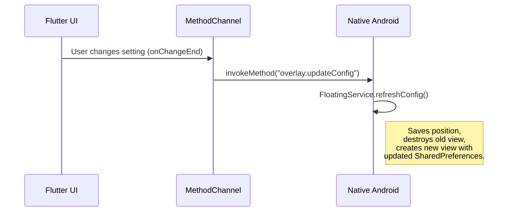

# Other — PLAN.md

# Developer Plan: Settings Sync & Polish

## Overview

This document outlines the technical plan for "Phase 5," which focused on creating a real-time synchronization mechanism between the Flutter UI settings and the native Android overlay service. It also covers the necessary build configurations to ensure application stability in release mode.

This file is an architectural plan, not executable code. It details the problem, the proposed solution, and the key components involved in the implementation.

## Problem: State Desynchronization

The core issue addressed by this plan is a state mismatch between the user-facing Flutter UI and the underlying native Android `FloatingService`.

When a user adjusts a setting in the Flutter UI (e.g., panel transparency or size via a slider), the new value is correctly saved to `SharedPreferences`. However, if the native `FloatingService` is already active, it remains unaware of this change. The service continues to render the overlay using its own cached configuration from when it was first initialized, leading to a disconnected user experience where UI changes are not reflected live.

The goal is to implement a communication pipeline from the Flutter engine to the native Android service to trigger an immediate visual refresh of the overlay whenever a setting is modified.

## Implementation Plan

The solution is broken down into four key steps, creating a robust communication channel and ensuring the native service can respond accordingly.

### 1. Cross-Engine Communication Channel

A platform method channel named `"overlay.updateConfig"` serves as the bridge between the Dart and Kotlin codebases.

-   **`overlay_channel.dart` (Flutter):** This file is responsible for invoking the method channel, sending the `"overlay.updateConfig"` message to the native side.
-   **`MainActivity.kt` (Android):** This class listens for incoming calls on the `"overlay.updateConfig"` channel and delegates the request to the running `FloatingService`.

This direct communication link allows the Flutter front-end to signal events to the native back-end.

### Settings Update Flow

The following diagram illustrates the sequence of events when a user changes a setting.

### 2. Native Overlay Refresh Logic

The `refreshConfig()` function within `FloatingService.kt` contains the logic for redrawing the overlay. To ensure a seamless user experience, it performs the following actions in sequence:

1.  **Preserve Position:** It reads and stores the overlay's current screen coordinates (`lastX`, `lastY`) from the active view. This prevents the overlay from snapping back to a default position after the refresh.
2.  **Destroy Old View:** The existing overlay view and its associated `WindowManager` instance are removed from memory.
3.  **Re-instantiate New View:** A new overlay view is created and added to the `WindowManager`. During its initialization, it reads the latest configuration values directly from `SharedPreferences`, thus applying the user's changes.

This entire process is designed to happen rapidly, appearing to the user as an instantaneous update or an "imperceptible sub-frame flicker."

### 3. UI Integration

The update process is initiated from the Flutter UI. Specifically, the `settings_screen.dart` and `customize_icon_screen.dart` modules trigger the method channel call. To optimize performance and avoid sending excessive messages, the call is tied to the `onChangeEnd` event on UI elements like sliders. This ensures the update is only requested once the user has finished making their adjustment.

### 4. Release Build Safeguards

To prevent the Android build tools (R8/ProGuard) from aggressively removing or obfuscating critical code in release builds, a `proguard-rules.pro` file is required. This file contains rules to specifically `-keep` classes and methods related to the custom Accessibility Service. Without these rules, the compiler might mistakenly strip essential code, causing crashes or preventing the overlay service from functioning in production App Bundles.