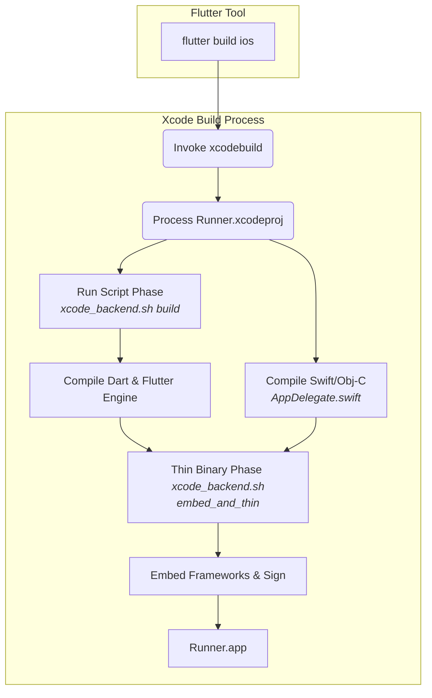

# Other — Runner.xcodeproj

# `Runner.xcodeproj`: iOS Host Application Configuration

This document provides a technical overview of the `Runner.xcodeproj` module, which defines the native iOS host application for the Flutter project. This is not a typical source code module but rather the configuration hub that enables the Flutter app to be built, packaged, and run on iOS devices.

## Overview

The `Runner.xcodeproj` is a standard Xcode project that acts as a thin wrapper or "host" for the Flutter application. Its primary responsibilities are:

1.  **Bootstrapping:** To create a native iOS application window and view controller that will host the Flutter UI.
2.  **Build Integration:** To integrate the Flutter toolchain into the standard Xcode build process, allowing for the compilation of Dart code and the embedding of the Flutter engine.
3.  **Native Configuration:** To manage all iOS-specific configurations, such as the app's bundle identifier, version number, device capabilities, permissions, and code signing.
4.  **Plugin Registration:** To provide the entry point for registering native iOS code for any Flutter plugins used by the application.

A developer typically interacts with this module when they need to add iOS-specific functionality that cannot be handled within the Flutter framework itself.

## Project Structure and Key Components

The project is configured through the `project.pbxproj` file and is best managed through Xcode. Opening `ios/Runner.xcworkspace` is the recommended way to edit the project.

### Targets

The project defines two primary `PBXNativeTarget` instances:

*   **`Runner`**: This is the main application target. It builds the final `Runner.app` bundle that gets installed on a device. Its build phases are orchestrated to compile both the native Swift/Objective-C shell and the Flutter code.
*   **`RunnerTests`**: A standard unit test target for any native Swift or Objective-C code written in the `Runner` project. It depends on the `Runner` target.

### Build Configurations

The project includes three build configurations that directly correspond to Flutter's build modes: `Debug`, `Release`, and `Profile`.

These configurations inherit their base settings from `.xcconfig` files located in the `ios/Flutter/` directory:
*   `Debug.xcconfig`
*   `Release.xcconfig`
*   `Generated.xcconfig` (auto-generated by Flutter)

This mechanism allows the Flutter toolchain to inject necessary build flags and paths (like the location of the Flutter SDK) into the Xcode build process without developers having to manage them manually. Key build settings like `PRODUCT_BUNDLE_IDENTIFIER`, `DEVELOPMENT_TEAM`, and `CURRENT_PROJECT_VERSION` are configured here.

### Key Files and Groups

The project navigator in Xcode organizes files into several groups:

*   **`Runner`**: Contains the core native source code and resources.
    *   `AppDelegate.swift`: The entry point of the native iOS application. It's a subclass of `FlutterAppDelegate` and is responsible for launching the Flutter engine. This is where you would add any custom native code that needs to run at app startup.
    *   `GeneratedPluginRegistrant.m`: An auto-generated file that registers the native iOS implementations of any Flutter plugins your app uses. **Do not edit this file manually**; it is updated by the Flutter tools.
    *   `Info.plist`: The application property list file. This is where you configure app metadata, permissions (e.g., camera access, location services), supported device orientations, and more.
    *   `Assets.xcassets`: The asset catalog for managing app icons, launch images, and other native image assets.
    *   `LaunchScreen.storyboard` & `Main.storyboard`: Used for the native launch screen and initial application interface before the Flutter UI is loaded.

*   **`Flutter`**: Contains the configuration files provided by the Flutter SDK, including the `.xcconfig` files mentioned above.

## Flutter Build Integration

The most critical aspect of `Runner.xcodeproj` is how it integrates the Flutter build process into the standard Xcode build pipeline. This is accomplished through two `PBXShellScriptBuildPhase` steps.



1.  **Run Script (`xcode_backend.sh build`)**: This is one of the first build phases. It executes a shell script provided by the Flutter SDK. This script is responsible for:
    *   Compiling your application's Dart code into a native framework (`App.framework`).
    *   Preparing the Flutter engine framework (`Flutter.framework`).
    *   Placing these frameworks in the appropriate build directory for Xcode to find.

2.  **Thin Binary (`xcode_backend.sh embed_and_thin`)**: This script runs later in the build process. It handles embedding the compiled Flutter frameworks into the final `Runner.app` bundle and stripping out any unused architectures to minimize the app's size.

These two scripts are the essential bridge between the native Xcode world and the Flutter world.

## Developer Workflow

While most development occurs in the `lib/` directory of the Flutter project, you will need to interact with `Runner.xcodeproj` for specific tasks.

### When to Modify the Project

*   **Adding App Capabilities**: To add capabilities like Push Notifications, Sign in with Apple, or HealthKit, you must enable them in the "Signing & Capabilities" tab of the `Runner` target in Xcode.
*   **Configuring `Info.plist`**: When a plugin or iOS feature requires a new key in `Info.plist` (e.g., `NSCameraUsageDescription` for camera access), you must add it here.
*   **Managing Native Dependencies**: If you need to add a native iOS library or framework (e.g., via CocoaPods or Swift Package Manager), you will manage it within the Xcode project.
*   **Custom Native Code**: For platform-specific integrations not covered by existing plugins, you will add your Swift or Objective-C code to the `Runner` group and potentially modify `AppDelegate.swift`.
*   **Changing Build Settings**: To override a specific build setting (e.g., changing the supported Swift version or deployment target), you would modify it in the "Build Settings" tab for the `Runner` target.

### Opening the Project

Always open the workspace file, not the project file, to ensure all dependencies (like those from CocoaPods) are correctly loaded:

```bash
open ios/Runner.xcworkspace
```