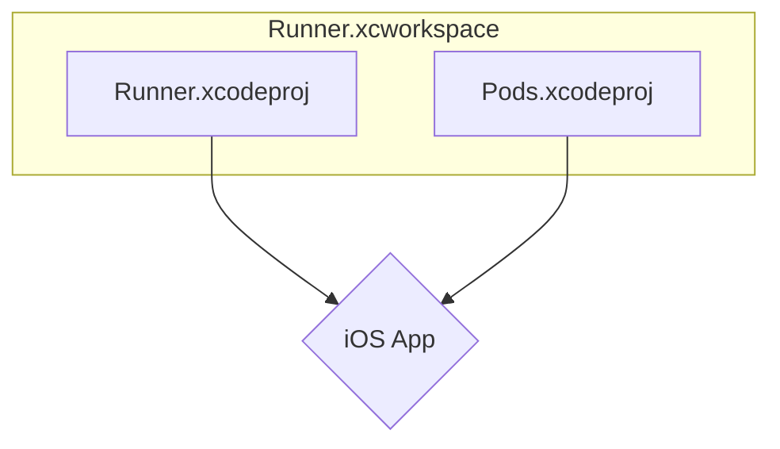

# Other — Runner.xcworkspace

# Module Documentation: `Runner.xcworkspace`

## Overview

The `Runner.xcworkspace` is the Xcode Workspace for the iOS portion of a Flutter application. It serves as the top-level container for managing the native iOS project and its dependencies within the Xcode IDE.

When you need to work on native iOS code—such as writing platform channels, configuring build settings, or debugging native crashes—you should open the `ios/Runner.xcworkspace` file in Xcode. Opening the `Runner.xcodeproj` file directly will result in build errors, as it will not link the necessary dependencies (e.g., from CocoaPods).

This module is not executable code; rather, it is a project configuration file that organizes source code and settings for the Xcode build system.

## Key Components

The workspace is defined by a directory containing several configuration files.

### `contents.xcworkspacedata`

This is the primary manifest for the workspace. It's a simple XML file that defines which Xcode projects are included. In a standard Flutter project, its main purpose is to reference the main application project:

```xml
<!-- ios/Runner.xcworkspace/contents.xcworkspacedata -->
<?xml version="1.0" encoding="UTF-8"?>
<Workspace
   version = "1.0">
   <FileRef
      location = "group:Runner.xcodeproj">
   </FileRef>
</Workspace>
```

The `<FileRef>` entry instructs Xcode to load the `Runner.xcodeproj` into the workspace. If the project used CocoaPods, another `FileRef` for the `Pods/Pods.xcodeproj` would also be present here, managed automatically by the `pod install` command.

### `xcshareddata/`

This directory contains settings that are shared among all developers working on the project.

*   **`WorkspaceSettings.xcsettings`**: This file stores user-configurable settings for the workspace. For example, it might disable features like SwiftUI Previews to improve IDE performance:
    ```xml
    <!-- ios/Runner.xcworkspace/xcshareddata/WorkspaceSettings.xcsettings -->
    <dict>
        <key>PreviewsEnabled</key>
        <false/>
    </dict>
    ```
*   **`IDEWorkspaceChecks.plist`**: This file is managed by Xcode to track the state of the IDE, such as which one-time warnings or checks have already been performed. This prevents Xcode from repeatedly notifying the user about the same issue (e.g., deprecation of 32-bit support).

## Role in the Flutter Build Process

The `Runner.xcworkspace` is a critical component for integrating the Flutter engine and plugins with your native iOS application code.

### Workspace vs. Project (`.xcworkspace` vs. `.xcodeproj`)

An Xcode Project (`.xcodeproj`) contains the files, resources, and build settings for a single application or library. An Xcode Workspace (`.xcworkspace`) is a container that can group multiple projects and their dependencies, allowing them to be built and managed together.

In a Flutter app, the workspace is essential for two main reasons:

1.  **Dependency Management**: Tools like CocoaPods, which manage native iOS dependencies (plugins), create their own `.xcodeproj` (e.g., `Pods.xcodeproj`). The workspace links your main `Runner.xcodeproj` with the `Pods.xcodeproj`, ensuring that all plugin code is compiled and linked correctly.
2.  **Flutter Engine Integration**: The Flutter toolchain uses this workspace structure to correctly embed the Flutter engine and other framework dependencies into the final iOS application.

The typical structure managed by the workspace looks like this:



### Interaction with the Flutter CLI

The `Runner.xcworkspace` is typically generated and managed by the Flutter toolchain and CocoaPods.

*   `flutter create`: Creates the initial `ios/` directory, including the `Runner.xcworkspace`.
*   `flutter pub get`: Triggers `pod install` within the `ios/` directory, which updates the workspace to include any native dependencies (plugins).
*   `flutter build ios` or `flutter run`: The Flutter build tool invokes Xcode's build system (`xcodebuild`) targeting this workspace to compile, link, and sign the final `.app` bundle.

Developers should generally avoid modifying the `contents.xcworkspacedata` file manually. Instead, modifications to the project structure should be done through standard tooling like adding files in Xcode or managing dependencies in `pubspec.yaml`.