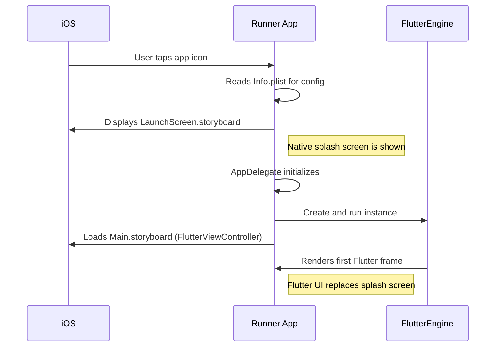

# Other — Runner

# iOS Runner Module

The `Runner` module is the native iOS application shell that hosts the Flutter application. It is not a typical library with callable functions, but rather the entry point and configuration layer that allows the Flutter code to execute on an iOS device. Its primary responsibilities are to handle the initial application launch sequence, display branding assets like the app icon and launch screen, and configure essential app metadata.

## Overview

When a user starts the application, the iOS operating system first interacts with this native `Runner` project. The `Runner` displays a native launch screen while it initializes the Flutter engine in the background. Once the Flutter engine is ready, it hands over control of the UI to the Flutter framework, which then renders the main application interface.

This module contains all the standard components of a basic Xcode project required for this process.

### Application Launch Flow

The launch sequence involves a handoff from the native iOS components to the Flutter engine.



## Key Components

The module is primarily composed of configuration files, storyboards, and asset catalogs.

### Application Configuration (`Info.plist`)

This file is the heart of the iOS app's configuration. It's a standard Apple property list that defines metadata for the system. Key properties include:

-   **`CFBundleDisplayName`**: The name shown on the home screen (`Assistive Touch Android`).
-   **`CFBundleIdentifier`**: The unique identifier for the app, typically set to `$(PRODUCT_BUNDLE_IDENTIFIER)`.
-   **`CFBundleVersion` / `CFBundleShortVersionString`**: The build and version numbers, which are populated by Flutter's build process using `$(FLUTTER_BUILD_NUMBER)` and `$(FLUTTER_BUILD_NAME)`.
-   **`UILaunchStoryboardName`**: Specifies `LaunchScreen` as the storyboard to display at startup.
-   **`UIMainStoryboardFile`**: Specifies `Main` as the storyboard for the primary application interface.

Any changes requiring iOS-specific permissions (e.g., Camera, Location) or integration with native services must be declared in this file.

### UI Entry Points (Storyboards)

The `Runner` uses two simple storyboards to manage the UI before and during Flutter's initialization.

#### `Base.lproj/LaunchScreen.storyboard`

This storyboard provides the initial user-facing UI. It is intentionally simple to load quickly.

-   It contains a single `UIImageView` (`YRO-k0-Ey4`).
-   The image view is constrained to the center of the screen.
-   It is configured to display the `LaunchImage` asset from the asset catalog.

This screen is displayed by the OS immediately upon launch and persists until the Flutter app is ready to draw its first frame.

#### `Base.lproj/Main.storyboard`

This is the main interface for the native app. Its role is to host the Flutter view.

-   It contains a single View Controller (`BYZ-38-t0r`).
-   This controller's custom class is set to `FlutterViewController`.
-   The `FlutterViewController`, provided by the Flutter framework, is the bridge that renders the Dart UI within a native iOS view. Once this controller is active, the entire screen is managed by Flutter.

### Visual Assets (`Assets.xcassets`)

This is the asset catalog for the native shell, containing pre-launch visuals.

-   **`AppIcon.appiconset`**: Defines all the required sizes of the application icon for different devices (iPhone, iPad) and contexts (Home Screen, Spotlight, Settings). The `Contents.json` file maps each required size to a specific PNG file.
-   **`LaunchImage.imageset`**: Contains the image displayed by `LaunchScreen.storyboard`. The `Contents.json` file provides 1x, 2x, and 3x resolution variants of `LaunchImage.png` to support various screen densities.

### Native Plugin Integration (`Runner-Bridging-Header.h`)

This header file is used to expose Objective-C code to the Swift environment of the `AppDelegate`. Its sole purpose in a standard Flutter project is to:

```objective-c
#import "GeneratedPluginRegistrant.h"
```

This makes the `GeneratedPluginRegistrant` class available, which is an auto-generated file that handles the registration of any Flutter plugins that have native iOS code. This is a critical step for ensuring plugins work correctly.

## How to Modify

As a developer, you will most likely interact with this module to customize the app's native appearance or add native capabilities.

### Customizing the App Icon or Display Name

1.  **To change the icon**: Replace the PNG files within `ios/Runner/Assets.xcassets/AppIcon.appiconset`. Ensure you provide images of the correct dimensions as specified in `Contents.json`. The easiest way to manage these is by opening `ios/Runner.xcworkspace` in Xcode and using the visual asset editor.
2.  **To change the display name**: Modify the `CFBundleDisplayName` string value in `ios/Runner/Info.plist`.

### Customizing the Launch Screen

You can change the static image displayed on launch by replacing the `LaunchImage.png` files in `ios/Runner/Assets.xcassets/LaunchImage.imageset`. For more complex launch screens, you can edit `LaunchScreen.storyboard` in Xcode to add other UI elements, but it's recommended to keep it simple for performance.

### Adding Native Capabilities

If your app needs to use native iOS features like Bluetooth, HealthKit, or custom URL schemes, you will need to:

1.  Add the required keys and descriptions to `Info.plist`.
2.  Enable capabilities in the Xcode project settings (`Signing & Capabilities` tab).
3.  Write native code (Swift or Objective-C) and connect it to your Dart code using platform channels. This native code would be added to the `Runner` project.