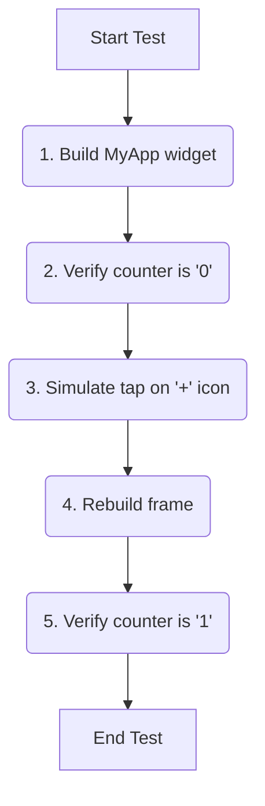

# Other — test

# Widget Test: `widget_test.dart`

This document provides an overview of the widget test module, `test/widget_test.dart`. This test serves as a basic "smoke test" for the application's UI, ensuring that the core state management and widget interaction are functioning as expected.

## Purpose and Scope

The primary purpose of this test is to verify the functionality of the counter feature present in the initial application screen, which is built from the `MyApp` widget in `main.dart`.

As a widget test, its scope is to:
*   Build and render the application's widget tree in a test environment.
*   Verify the initial UI state.
*   Simulate user interactions, such as taps.
*   Verify that the UI correctly reflects the resulting state changes.

This test confirms that the connection between the user tapping the '+' button and the counter text updating on screen is working correctly.

## Test Flow and Logic

The test follows the standard "Arrange-Act-Assert" pattern, which is common for testing UI and logic. The entire test case is defined within a `testWidgets` block, which provides a `WidgetTester` utility to drive the test.



### 1. Setup: Building the Widget Tree

```dart
await tester.pumpWidget(const MyApp());
```
The test begins by building the root widget of the application, `MyApp`. The `tester.pumpWidget()` function renders the UI and prepares it for interaction.

### 2. Initial State Verification

```dart
// Verify that our counter starts at 0.
expect(find.text('0'), findsOneWidget);
expect(find.text('1'), findsNothing);
```
Immediately after the app is built, the test asserts the initial state. It uses `find.text()` to locate widgets displaying specific strings. The `expect` function, combined with matchers like `findsOneWidget` and `findsNothing`, verifies that:
*   A widget with the text '0' is present on the screen.
*   No widget with the text '1' exists yet.

### 3. Simulating User Interaction

```dart
// Tap the '+' icon and trigger a frame.
await tester.tap(find.byIcon(Icons.add));
await tester.pump();
```
This is the "Act" phase of the test.
*   `tester.tap()`: Simulates a user tapping a widget.
*   `find.byIcon(Icons.add)`: A finder that locates the tappable widget by its `IconData`.
*   `await tester.pump()`: After the tap, the application's state changes. This call tells the test environment to advance the clock and rebuild any widgets that need updating due to the state change. Without this, the UI would not reflect the incremented counter.

### 4. Final State Verification

```dart
// Verify that our counter has incremented.
expect(find.text('0'), findsNothing);
expect(find.text('1'), findsOneWidget);
```
Finally, the test asserts the new state of the UI. It confirms that the original '0' text is gone and has been replaced by a '1', proving that the tap interaction successfully updated the application state and the UI rebuilt correctly.

## How to Run the Test

This test can be executed from the command line in the root of the project. It is part of the standard test suite.

To run this specific test file:
```bash
flutter test test/widget_test.dart
```

To run all tests in the project:
```bash
flutter test
```