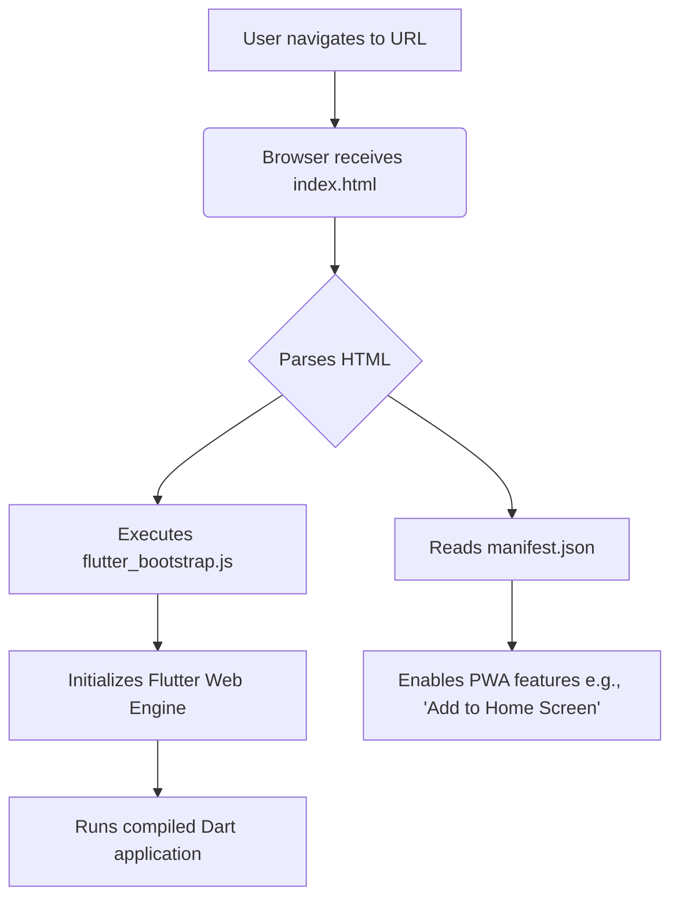

# Other — web

# Module Documentation: Web

This document provides an overview of the `web` directory, which contains the necessary files to host and run the Flutter application in a web browser. These files serve as the web-native shell for the application, enabling Progressive Web App (PWA) features and bootstrapping the Flutter engine.

## Overview

The `web` module is the entry point for the web-compiled version of this Flutter project. It does not contain any Dart code but instead consists of static assets that a web server provides to a user's browser. When a user navigates to the application's URL, the browser first loads `index.html`, which then initiates the entire Flutter application lifecycle.

The primary responsibilities of this module are:

1.  **Bootstrapping**: Loading and initializing the Flutter web engine and the compiled application code.
2.  **PWA Configuration**: Defining metadata that allows the web app to be "installed" on a user's home screen and behave like a native application.
3.  **Branding & Metadata**: Specifying the application's name, icons, and description as they appear in browser tabs, bookmarks, and home screens.

## Key Components

The module consists of two primary configuration files and a directory for icons.

### `index.html`

This is the main HTML document that hosts the Flutter application. When a user visits the site, this file is served first.

Its key elements are:

-   **Base Href**:
    ```html
    <base href="$FLUTTER_BASE_HREF">
    ```
    This tag is critical for routing. It specifies the base URL for all relative paths in the document. The `$FLUTTER_BASE_HREF` value is a placeholder that is automatically replaced by the Flutter build tools when you run `flutter build web --base-href /my/path/`. This ensures the app can be hosted in a subdirectory of a domain without breaking asset or route paths.

-   **Flutter Bootstrap Script**:
    ```html
    <script src="flutter_bootstrap.js" async></script>
    ```
    This is the most important line in the file. It loads the `flutter_bootstrap.js` script, which is responsible for detecting the user's browser and loading the appropriate Flutter web engine (HTML or CanvasKit). Once the engine is ready, it downloads and runs your compiled Dart code (`main.dart.js`).

-   **PWA and SEO Metadata**: The `<head>` section contains various `<meta>` and `<link>` tags that define the application's appearance and behavior, including the title, description, and icons for iOS home screen support.

### `manifest.json`

This file is the [Web App Manifest](https://developer.mozilla.org/en-US/docs/Web/Manifest), a core component of Progressive Web Apps. It's a simple JSON file that provides the browser with metadata about the application.

Key properties defined in this manifest include:

-   `name` / `short_name`: The application's display name.
-   `start_url`: The entry point URL when the app is launched from an installed icon. `.` makes it relative to the manifest's location.
-   `display`: Set to `standalone`, this tells the browser to launch the app in its own window, without the standard browser UI (address bar, buttons), creating a more native-like experience.
-   `background_color` / `theme_color`: Defines the color of the splash screen and the browser's toolbar.
-   `icons`: An array of application icons of various sizes, used for the home screen icon, splash screen, and other system UIs. It includes `maskable` icons, which ensure the icon looks good on all Android devices.

## Execution Flow

The loading process is orchestrated by the browser and the Flutter bootstrap script. There is no server-side execution logic in this module.



1.  The browser requests and parses `index.html`.
2.  It discovers the link to `manifest.json` and makes PWA features available.
3.  The `<script>` tag for `flutter_bootstrap.js` is executed.
4.  The bootstrap script initializes the Flutter engine and runs the main application logic compiled from your Dart code. The Flutter framework then takes control and renders the UI within the `<body>` of the page.

## How to Customize

Developers may need to modify these files to change the web app's branding or add web-specific integrations.

-   **Changing App Name and Colors**: To change the name, description, or theme colors, edit the relevant fields in `index.html` (for the `<title>`) and `manifest.json`.

    ```json
    // In manifest.json
    "name": "Your App Name",
    "short_name": "YourApp",
    "theme_color": "#YOUR_HEX_COLOR",
    ```

-   **Updating Icons**: Replace the placeholder icon files in `web/icons/` with your own branded icons. Ensure you provide all the specified sizes for the best experience across devices. You can use online tools to generate the different PWA icon sizes from a single source image.

-   **Adding Analytics or Custom Scripts**: If you need to add third-party scripts like Google Analytics, add the required `<script>` tags to `index.html` in the `<head>` or `<body>` section, just as you would for a standard website.