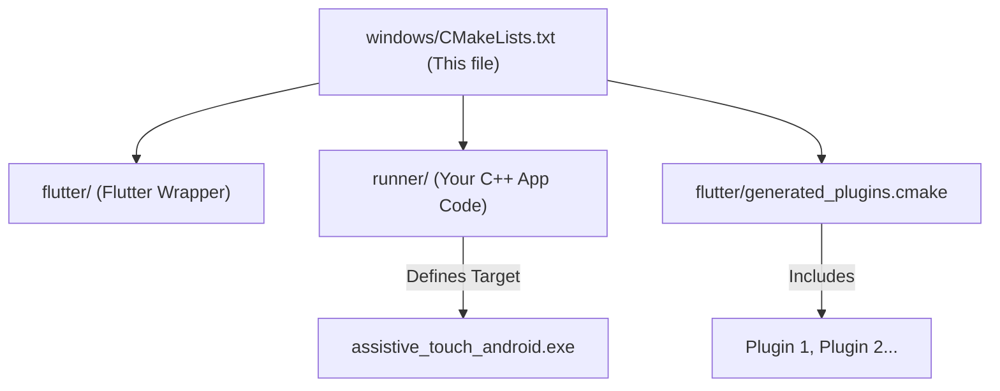

# Other — windows

# Documentation: Windows Build Configuration (`windows/CMakeLists.txt`)

This document provides a technical overview of the root `CMakeLists.txt` file for the Windows platform. This file serves as the master build script, orchestrating the compilation of the C++ application runner, the integration of the Flutter engine, and the bundling of all necessary assets to create a runnable Windows application.

## Overview

The primary role of this CMake script is to configure the native Windows build environment and define a process for assembling a complete, self-contained application. It does not contain the application's C++ source code logic itself (which resides in the `runner` subdirectory), but rather acts as the top-level conductor for the entire build process.

Its core responsibilities include:

*   **Project Definition**: Sets the final executable name (`assistive_touch_android`) and required CMake version.
*   **Build Configuration**: Manages build types (`Debug`, `Profile`, `Release`) and their corresponding compiler/linker flags.
*   **Compiler Standards**: Enforces a consistent set of compiler warnings, C++ standard version, and definitions across all native code modules.
*   **Component Integration**: Includes and configures the three main parts of the native application: the Flutter engine library, the application runner, and any native plugins.
*   **Application Bundling**: Defines an "install" process that copies the compiled executable, libraries, and Flutter assets into a runnable structure within the build directory.

## Build Flow and Component Integration

This script integrates several key components to produce the final application. The relationship between them is defined by the `add_subdirectory` and `include` commands.



1.  **`flutter/`**: This directory, managed by the Flutter toolchain, contains the CMake scripts necessary to link against the core Flutter engine (`flutter_windows.dll`) and the C++ wrapper library.
2.  **`runner/`**: This is where the application-specific C++ code resides. The `CMakeLists.txt` in this subdirectory defines the actual executable target (`BINARY_NAME`) and compiles the C++ source files that host the Flutter view.
3.  **`flutter/generated_plugins.cmake`**: This file is automatically generated by the Flutter tool (`flutter pub get`). It contains the necessary CMake commands to find, build, and link any native Windows plugins your project depends on. **You should not edit this file manually.**

## Key Sections and Configuration

### Build Type Management

The script robustly handles different build configurations. It detects whether CMake is using a multi-config generator (like Visual Studio) or a single-config generator.

*   For Visual Studio, it populates `CMAKE_CONFIGURATION_TYPES` with `Debug;Profile;Release`.
*   For others, it defaults to a `Debug` build via `CMAKE_BUILD_TYPE`.

Notably, it explicitly sets the flags for the `Profile` configuration to match the `Release` configuration, ensuring optimized builds for profiling.

```cmake
# Define settings for the Profile build mode.
set(CMAKE_EXE_LINKER_FLAGS_PROFILE "${CMAKE_EXE_LINKER_FLAGS_RELEASE}")
set(CMAKE_SHARED_LINKER_FLAGS_PROFILE "${CMAKE_SHARED_LINKER_FLAGS_RELEASE}")
set(CMAKE_C_FLAGS_PROFILE "${CMAKE_C_FLAGS_RELEASE}")
set(CMAKE_CXX_FLAGS_PROFILE "${CMAKE_CXX_FLAGS_RELEASE}")
```

### Standard Compiler Settings (`APPLY_STANDARD_SETTINGS`)

To ensure code quality and consistency across the main runner and all plugins, a standard set of compiler options is applied via the `APPLY_STANDARD_SETTINGS` function.

```cmake
function(APPLY_STANDARD_SETTINGS TARGET)
  target_compile_features(${TARGET} PUBLIC cxx_std_17)
  target_compile_options(${TARGET} PRIVATE /W4 /WX /wd"4100")
  target_compile_options(${TARGET} PRIVATE /EHsc)
  target_compile_definitions(${TARGET} PRIVATE "_HAS_EXCEPTIONS=0")
  target_compile_definitions(${TARGET} PRIVATE "$<$<CONFIG:Debug>:_DEBUG>")
endfunction()
```

This function is called for the main runner and is also used by the plugin build scripts. Its key effects are:
*   **C++17 Standard**: Enforces the use of the C++17 standard.
*   **Strict Warnings**: Sets warning level 4 (`/W4`) and treats warnings as errors (`/WX`) to maintain code health. It disables warning `4100` (unreferenced formal parameter), which is common in boilerplate code.
*   **Exception Handling**: Enables the compiler's exception handling mechanism (`/EHsc`) for stack unwinding but disables language-level exceptions (`_HAS_EXCEPTIONS=0`) for performance, a common pattern in the Flutter engine.

### Application Bundling (The "Install" Phase)

This script uses CMake's `install()` command in a non-traditional way. Instead of installing files to a system-wide location (like `C:\Program Files`), it assembles a runnable application bundle directly inside the build output directory. This is a critical feature that enables a seamless "build and run" experience (e.g., pressing F5 in Visual Studio).

This is achieved by setting the installation prefix to the executable's output directory:

```cmake
set(BUILD_BUNDLE_DIR "$<TARGET_FILE_DIR:${BINARY_NAME}>")
# ...
set(CMAKE_INSTALL_PREFIX "${BUILD_BUNDLE_DIR}" CACHE PATH "..." FORCE)
```

The subsequent `install()` commands copy all necessary runtime components into this bundle directory:

*   **The Executable**: The compiled `assistive_touch_android.exe`.
*   **Flutter Engine**: `flutter_windows.dll`.
*   **ICU Data**: The `icudtl.dat` file, required for internationalization and text rendering.
*   **Plugin Libraries**: Any `.dll` files built by native plugins.
*   **Native Assets**: Any native assets provided by Dart packages are copied from `build/native_assets/windows/`.
*   **Flutter Assets**: The entire `flutter_assets` directory (containing fonts, images, and compiled Dart code) is copied. The script first removes any existing directory to prevent stale assets.
*   **AOT Library**: For `Profile` and `Release` builds, the Ahead-Of-Time compiled Dart code (`app.so`) is copied into the `data` directory. This file is absent in `Debug` builds, which use a JIT engine.

## How to Contribute

*   **Modifying App-Specific Build Settings**: If you need to add compiler definitions or link against new libraries for your application code, make those changes in `windows/runner/CMakeLists.txt`. Avoid modifying the root `CMakeLists.txt` unless the change needs to apply globally to plugins as well.
*   **Adding/Removing Plugins**: You do not need to edit this file to manage plugins. Simply use `flutter pub add` or `flutter pub remove`. The `flutter/generated_plugins.cmake` file will be updated automatically, and the build system will incorporate the changes on the next build.
*   **Troubleshooting Missing Files**: If your application fails to run due to a missing DLL or asset, verify the `install()` commands in this file. Check the final bundle directory (e.g., `build/windows/runner/Debug/`) to see if the required file was copied correctly.