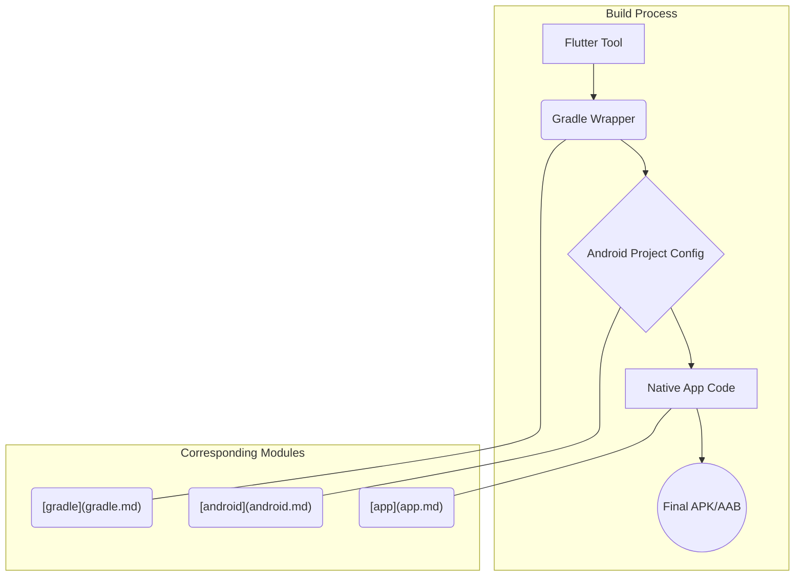
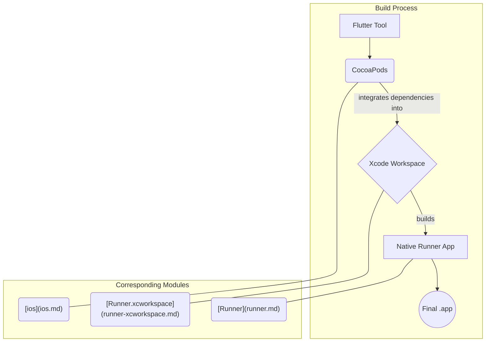

# Other

# Other

The **Other** module is a collection of configuration files, native platform hosts, build scripts, and project documentation. It contains the essential scaffolding required to build, run, and manage the Flutter application, but does not include the application's core Dart source code.

Its primary purpose is to handle everything outside of the Flutter UI and business logic, from defining project dependencies to compiling the native shell for each target platform.

## Project Configuration and Process

This group of modules defines the project's identity, rules, and development process. They work together to ensure consistency and provide a "source of truth" for development.

-   **Project Definition**: The `[pubspec.yaml](pubspec-yaml.md)` file is the central manifest, defining dependencies and project metadata. The Dart linter is configured in `[analysis_options.yaml](analysis_options-yaml.md)` to enforce code style.
-   **Requirements and Planning**: The development lifecycle begins with the Product Requirements Document (PRD) located in the `[docs](docs.md)` module. The `[scripts](scripts.md)` module contains utilities like `check_prd` to keep a local copy of the PRD synchronized. High-level technical strategies are documented in files like `[PLAN.md](plan-md.md)`.
-   **Conventions**: The project follows a standardized format for developer logs, as specified in the `[diary-schema](diary-schema.md)`.

## Native Platform Integration

A Flutter application cannot run on its own; it must be hosted within a native application shell on each target platform. This group of modules provides these shells and their corresponding build system configurations.

### Android

The Android build is managed by Gradle. The `[gradle](gradle.md)` wrapper ensures a consistent build environment. It executes the build process defined in the main `[android](android.md)` module, which compiles the native services and receivers in the `[app](app.md)` module and packages them with the Flutter code into a final APK or AAB.

### iOS

The iOS build is managed by Xcode and CocoaPods. The `[ios](ios.md)` module's `Podfile` defines native dependencies. These dependencies are integrated with the main `[Runner.xcodeproj](runner-xcodeproj.md)` into a single `[Runner.xcworkspace](runner-xcworkspace.md)`. This workspace is used to build the native host application defined in the `[Runner](runner.md)` module, which then loads the Flutter engine.

### Other Platforms

The application supports other platforms using a similar host-and-build-system pattern:
-   **Desktop**: `[linux](linux.md)`, `[macos](macos.md)`, and `[windows](windows.md)` modules use CMake and CocoaPods to configure and build their respective native runners.
-   **Web**: The `[web](web.md)` module contains the `index.html` and JavaScript bootstrapping files needed to load and run the Flutter application in a browser.

## Testing

This module group contains test suites for both the Flutter and native layers:
-   The `[test](test.md)` module holds standard Flutter widget tests to verify UI components.
-   The `[RunnerTests](runnertests.md)` module provides a target for writing XCTest-based unit tests for any custom native Swift or Objective-C code in the iOS host.