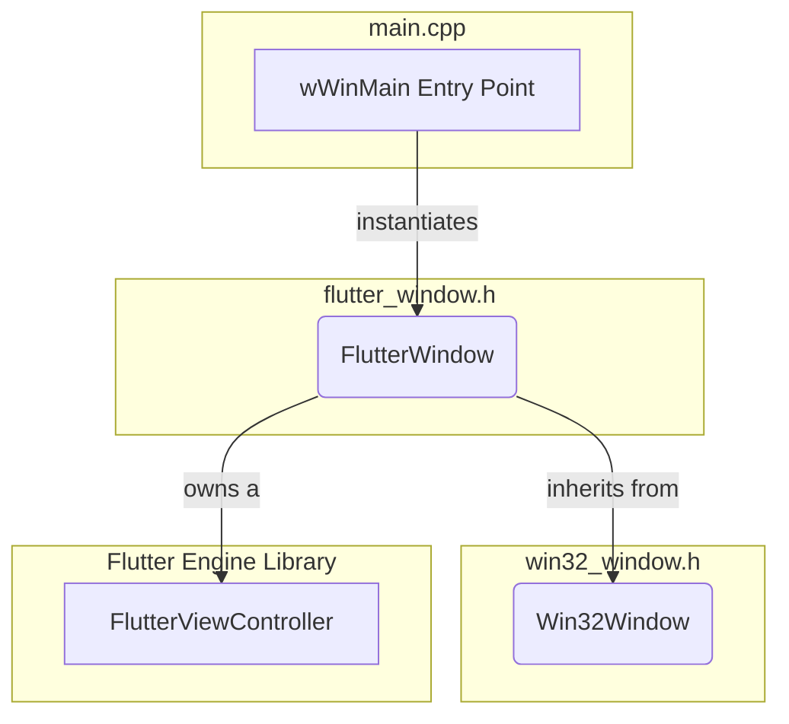

# Windows Application Host

# Documentation: Windows Application Host

This document provides a developer-focused overview of the Windows Application Host module, the native shell responsible for bootstrapping and running a Flutter application on Windows.

## Overview

The Windows Application Host is the bridge between the Windows operating system and the Flutter engine. Its primary responsibilities are:

*   **Window Management**: Creating and managing the native Win32 window that displays the Flutter UI. This includes handling DPI scaling, system theme changes (light/dark mode), and window lifecycle events.
*   **Flutter Engine Initialization**: Instantiating the `FlutterViewController`, which contains the Flutter engine and view.
*   **Event Forwarding**: Running the main Windows message loop and forwarding relevant messages (like mouse clicks, keyboard input, and window resizing) to the Flutter engine for processing.
*   **Application Entry Point**: Providing the standard `wWinMain` entry point for the executable.

The architecture is designed to separate generic Win32 window logic from the specific logic required to host Flutter.

## Architecture

The host is built on two main classes: `Win32Window`, a generic window wrapper, and `FlutterWindow`, a specialization that hosts the Flutter content. The application entry point, `wWinMain`, orchestrates the setup.

1.  **`wWinMain`**: The application starts here. It initializes the environment, creates a `FlutterWindow` instance, and starts the Windows message pump.
2.  **`Win32Window`**: A general-purpose C++ wrapper for a Win32 window (`HWND`). It knows nothing about Flutter and handles window class registration, message dispatching, and basic window behaviors like resizing and DPI changes.
3.  **`FlutterWindow`**: Inherits from `Win32Window` and specializes it for hosting Flutter. Its key role is to create and manage the `FlutterViewController` and embed its view within the main window.

---

## Key Components

### `main.cpp` (Application Entry Point)

This file contains `wWinMain`, the entry point for the Windows application. Its execution flow is straightforward:

1.  **Console Setup**: Attaches to a parent console (e.g., when run via `flutter run`) or creates a new one if a debugger is present. This is handled by `CreateAndAttachConsole`.
2.  **COM Initialization**: Initializes the COM library for use by the application or its plugins.
3.  **Flutter Project Setup**: Creates a `flutter::DartProject` instance, which tells the engine where to find the application's assets and Dart code (in the `data` directory).
4.  **Command-Line Arguments**: Parses command-line arguments using `GetCommandLineArguments` and passes them to the Dart project, making them available to the Dart entry point (`main`).
5.  **Window Creation**: Instantiates `FlutterWindow`, calls `Create()` to construct the underlying Win32 window, and sets it to terminate the application when closed via `SetQuitOnClose(true)`.
6.  **Message Loop**: Runs the standard Windows message loop (`while (::GetMessage(...))`). This loop listens for OS events and dispatches them to the appropriate window procedure (`WndProc`). The loop terminates when `PostQuitMessage` is called (typically on window close).
7.  **Cleanup**: Uninitializes COM before exiting.

### `Win32Window` (Generic Window Wrapper)

This class provides a clean, object-oriented abstraction over the Win32 windowing API. It is designed to be reusable and is not directly coupled to Flutter.

**Key Features:**

*   **Lifecycle Management**: The `Create()` method handles the complex process of registering a window class (via the singleton `WindowClassRegistrar`), creating the window with `CreateWindow`, and scaling its initial size based on the monitor's DPI. `Destroy()` handles cleanup.
*   **Message Handling**: The static `WndProc` is the initial C-style callback for all window messages. It immediately forwards messages to the instance-specific `MessageHandler` virtual function. This allows subclasses like `FlutterWindow` to override and intercept messages.
*   **Child Content Hosting**: The `SetChildContent(HWND content)` method is crucial for composition. It takes a window handle (in our case, the Flutter view) and makes it a child of the main window, ensuring it resizes to fill the client area.
*   **DPI and Theme Awareness**: It handles `WM_DPICHANGED` to resize the window correctly on DPI changes. It also uses `DwmSetWindowAttribute` in `UpdateTheme` to ensure the window's non-client area (title bar) respects the user's light/dark mode preference in Windows settings.

### `FlutterWindow` (Flutter Host)

This class is the core of the application host. It inherits from `Win32Window` and implements the specific logic needed to load and display a Flutter UI.

**`OnCreate()` - The Initialization Hub**

The most important logic resides in the `OnCreate()` override. This method is called by `Win32Window::Create` after the parent window has been successfully created.

1.  **Controller Creation**: It instantiates a `flutter::FlutterViewController`, passing the window's client area dimensions and the `DartProject`. This object encapsulates the Flutter engine and the native view that renders the UI.
2.  **Plugin Registration**: It calls `RegisterPlugins()`, a generated function that registers any native Windows plugins used by the application.
3.  **Content Embedding**: It retrieves the native window handle from the Flutter view (`flutter_controller_->view()->GetNativeWindow()`) and passes it to `SetChildContent()`. This embeds the Flutter UI inside our main `Win32Window`.
4.  **Seamless Startup**: To avoid showing a blank white window while Flutter initializes, it uses `SetNextFrameCallback`. The callback, which simply calls `this->Show()`, is only invoked after the Flutter engine has rendered its very first frame. `ForceRedraw()` is called to ensure a frame is scheduled, guaranteeing the callback will run.

**`MessageHandler()` - Input and Event Forwarding**

This override is the primary mechanism for routing Windows messages to Flutter.

1.  **Flutter First**: It first gives the `flutter_controller_` an opportunity to process the message by calling `HandleTopLevelWindowProc()`. This is how all user input (mouse, keyboard) and many window messages are passed to the Flutter framework and its plugins.
2.  **Host-Specific Handling**: If Flutter does not handle the message, `FlutterWindow` can handle it. For example, it listens for `WM_FONTCHANGE` to call `engine()->ReloadSystemFonts()`.
3.  **Default Behavior**: If the message is still unhandled, it calls the base class implementation, `Win32Window::MessageHandler`, for default processing (e.g., `WM_SIZE`, `WM_DESTROY`).

### `utils` (Utilities)

A small collection of helper functions:

*   `CreateAndAttachConsole()`: Provides console output for debugging.
*   `GetCommandLineArguments()`: A helper that correctly parses the Win32 `wchar_t*` command line into a `std::vector<std::string>` of UTF-8 encoded arguments suitable for the Flutter engine. It uses `Utf8FromUtf16` for the character encoding conversion.